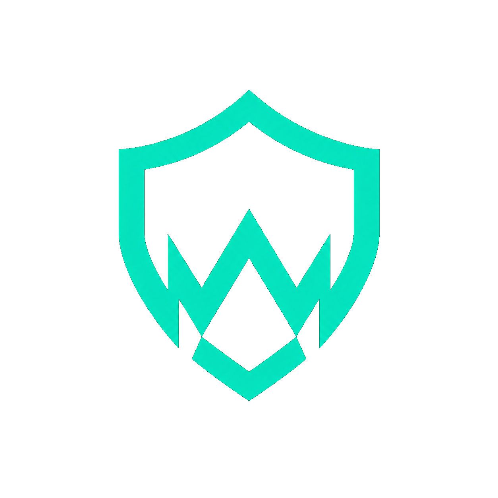
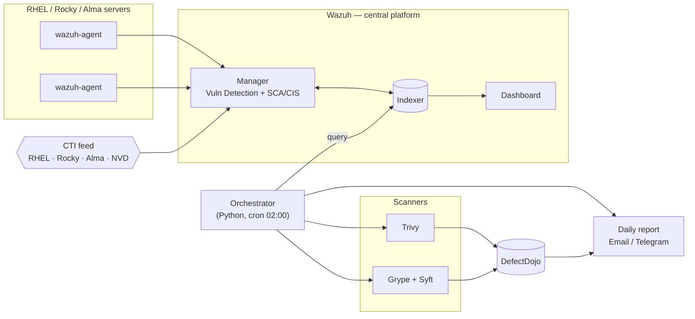

<p align="center">
  
</p>

<h1 align="center">Warden</h1>

<p align="center"><b>Self-hosted, open-source vulnerability monitoring & daily security reporting for RHEL-family fleets.</b></p>

<p align="center">
  <a href="https://github.com/HackNow-uz/Warden/actions/workflows/ci.yml"></a>
  
  
  
  
  
</p>

<p align="center">📊 <a href="https://hacknow-uz.github.io/Warden/"><b>Live presentation →</b> hacknow-uz.github.io/Warden</a></p>

Warden continuously watches every server, container image, and code dependency across your
infrastructure for known vulnerabilities, runs CIS/SCAP compliance checks, aggregates everything
into one dashboard, and emails a full security report every day — all from open-source components,
wired together with a small, well-tested orchestrator. No SaaS, no per-host licensing.

> Note: low-level infrastructure identifiers use the short codename `tizim`
> (e.g. the `tizim_net` Docker network and `/opt/tizim` paths).

---

## What it covers

| Dimension | Engine |
|---|---|
| 🖥️ **OS package CVEs** (installed RPMs) | Wazuh agent + CTI feed |
| 🐳 **Docker image vulnerabilities** | Trivy + Grype |
| 🧩 **Code dependencies** (pip / npm / go.mod) | Trivy filesystem scan |
| 📋 **CIS Benchmark / SCAP compliance** | OpenSCAP + SSG |

Findings from all sources are aggregated in **DefectDojo** (dedup + trend) and a daily HTML report
(summary + every Critical inline, full findings as an attachment) is delivered via **email/Telegram**.

## Architecture



Two layers: a **central Docker Compose stack** (Wazuh + DefectDojo + orchestrator) and
**Ansible roles** that provision `wazuh-agent` + OpenSCAP on RHEL targets.
Full diagrams: [`docs/architecture.md`](docs/architecture.md).

## Tech stack

`Wazuh 4.9` · `Trivy` · `Grype` · `Syft` · `DefectDojo` · `OpenSCAP` ·
`Python 3.12` (pytest) · `Docker Compose` · `Ansible` · `GitHub Actions CI`

## Highlights

- 🔁 **Fully automated** daily cycle (cron) — scan → aggregate → report → heartbeat.
- 🔐 **Security-first**: secrets required (no defaults), TLS verification never disabled,
  no `docker.sock` mount, internal-only port binding, automated Wazuh password rotation.
- 🧱 **Infrastructure-as-Code**: declarative networking, resource limits, healthchecks,
  one-command bootstrap, idempotent scripts.
- ✅ **Tested**: 20 unit tests, CI validates pytest + compose + Ansible + shell syntax.
- 📊 **Rich reporting**: HTML report with severity-coded tables, full findings attachment.
- ♻️ **Operable**: ISM retention, DB backups, log rotation, dead-man's-switch monitoring.

## Quick start (local) — one command

```bash
git clone https://github.com/HackNow-uz/Warden && cd Warden
./setup.sh            # preflight + auto-generates secrets + brings up the full stack
bash test/e2e.sh      # end-to-end smoke test
```
`setup.sh` checks Docker / RAM / `vm.max_map_count` / ports, **auto-generates DefectDojo
secrets** (no manual editing), then bootstraps Wazuh + DefectDojo + orchestrator.
Just want to verify prerequisites? `./setup.sh --check`. Then optionally:
`bash scripts/configure-retention.sh` (index retention).
Access (internal-only) via SSH tunnel:
```bash
ssh -L 8444:127.0.0.1:8444 -L 8888:127.0.0.1:8888 user@host
# Wazuh: https://localhost:8444   ·   DefectDojo: http://localhost:8888
```
> Full stack needs ~12 GB RAM. See the guide for low-RAM staging.

## Documentation

- 📘 **[Full Guide](docs/GUIDE.md)** — install · configure · operate · troubleshoot · extend
- 🚀 **[Production Readiness](docs/PROD-READINESS.md)** — deploy runbook + checklist
- 🏗️ **[Architecture](docs/architecture.md)** — components, data flow, diagrams
- 📐 **[Design spec](docs/specs/2026-05-29-tizim-design.md)** · **[Build plan](docs/plans/2026-05-29-tizim-build.md)**

## Project structure

```
compose/      central stack — wazuh/ · defectdojo/ · orchestrator/ (Python)
ansible/      wazuh_agent + openscap roles, inventory
scanning/     scan targets (images.txt, repos.yml)
scripts/      bootstrap, secret rotation, telegram, retention, backup, enroll
test/         e2e smoke test
docs/         guide, architecture, production readiness, spec, plan
```

## License

[MIT](LICENSE)
