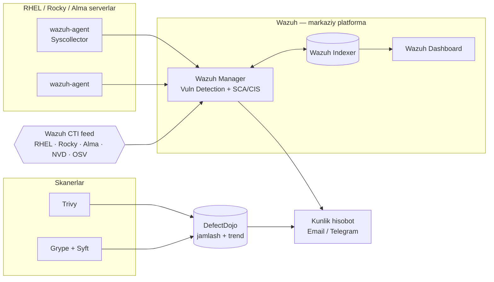
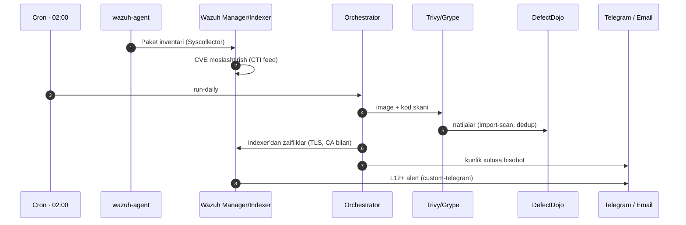
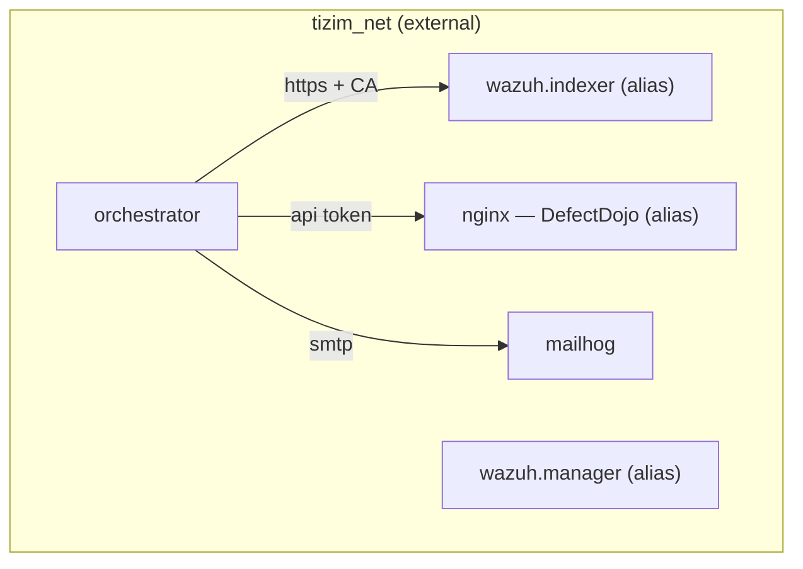

# TIZIM — Arxitektura

Self-hosted, ochiq kodli ichki xavfsizlik monitoring platformasi. To'rt o'lcham
(OS paket CVE · Docker image · kod bog'liqlik · CIS/SCAP) bitta markazda
jamlanadi va har kuni avtomatik hisobot yuboriladi.

> Vizual taqdimot (rahbariyat uchun): [`prezentatsiya.html`](prezentatsiya.html)
> To'liq spetsifikatsiya: [`specs/2026-05-29-tizim-design.md`](specs/2026-05-29-tizim-design.md)

## Komponentlar

| Tool | Rol | Qoplaydigan o'lcham |
|---|---|---|
| **Wazuh** (manager + indexer + dashboard) | Markaziy platforma, agent, alert | OS paket CVE + CIS/SCA |
| **Trivy** | Image + kod bog'liqlik skaneri | Docker + deps + OS |
| **Grype + Syft** | Cross-check skaner (SBOM) | Docker + deps |
| **DefectDojo** | Jamlash, dedup, trend, hisobot | — (agregatsiya) |
| **OpenSCAP + SSG** | RHEL CIS audit | Compliance (config) |
| **Orchestrator** (Python) | Glue: skan → import → hisobot → alert | — (avtomatika) |

## Yuqori darajadagi arxitektura



## Kunlik skan sikli



## Tarmoq (lokal)



`bootstrap-central.sh` `tizim_net`'ni yaratadi va Wazuh/DefectDojo konteynerlarini
unga **alias** bilan ulaydi — shunda orchestrator `wazuh.indexer` (TLS sertifikat
SAN'iga mos) va `nginx` nomlari orqali yetadi.

## Lokal sinov vs Production

### Lokal sinov (bu repo)
```bash
cp compose/.env.example compose/.env
cp compose/defectdojo/.env.example compose/defectdojo/.env   # majburiy kalitlarni to'ldiring
bash scripts/bootstrap-central.sh
docker compose -f test/docker-compose.targets.yml up -d       # soxta Rocky agent
bash scripts/enroll-agents.sh
bash test/e2e.sh
```
⚠️ To'liq stek ~10–12 GB RAM. Kam RAM'da Wazuh va DefectDojo navbatma-navbat sinaladi.

### Production (RHEL target server)
1. **Maxfiy kalitlar:** `compose/defectdojo/.env` va `compose/.env`'da barcha
   `CHANGE_ME` / bo'sh qiymatlarni real qiymatlar bilan to'ldiring
   (`openssl rand -base64 24`, `python -c 'import secrets;print(secrets.token_urlsafe(50))'`).
2. **Default parollar:** Wazuh `INDEXER_PASSWORD`, `API_PASSWORD`, dashboard parolini o'zgartiring.
3. **DD_ALLOWED_HOSTS:** o'z FQDN'ingizni qo'shing.
4. **Telegram:** `wazuh_manager.conf` ichidagi `<hook_url>BOT_TOKEN|CHAT_ID</hook_url>` va
   `compose/.env`dagi `TELEGRAM_*` ni real qiymatlar bilan almashtiring.
5. **SMTP:** mailhog o'rniga real SMTP server (`SMTP_HOST/PORT/FROM/TO`).
6. **Image registry:** `scanning/images.txt`'ga prod image ref'larini qo'shing;
   private registry bo'lsa orchestrator'ga kredensial bering.
7. **Inventar:** `ansible/inventory.ini`'ga real serverlar; `ansible_password` o'rniga SSH kalit.
8. **Resurs:** single-node (<100 agent): 4 vCPU, 8–16 GB RAM, ≥50 GB disk.

## Tasdiqlash holati (bu repo qurilishida)

| Qism | Tekshiruv | Holat |
|---|---|---|
| Orchestrator (Python) | 11 unit test (pytest) | ✅ PASS |
| Wazuh compose + ossec.conf | `docker compose config` + XML well-formed | ✅ VALID |
| DefectDojo compose | `docker compose config` + maxfiy guard | ✅ VALID |
| Ansible ro'llari | `ansible-playbook --syntax-check` | ✅ PASS |
| Skriptlar | `bash -n` | ✅ PASS |
| Telegram integ. | `py_compile` | ✅ VALID |
| To'liq live stek (Wazuh+DD birga) | `docker compose up` + e2e | ⏸ deploy target'da (lokal 7 GB RAM yetmadi) |

## Xavf va e'tibor (research'dan)

- Wazuh 4.8 rewrite: `vulnerability-detection` (yangi tag), indexer aloqasi shart.
- Red Hat OVAL v2 → CSAF/VEX: OpenSCAP faqat config compliance uchun; CVE Wazuh CTI + Trivy.
- Scanner kelishmovchiligi (~31%): Trivy + Grype, DefectDojo dedup.
- Trivy: image'larni **ref bo'yicha** skanlash (flatten false-positive oldini olish).
- TLS verification hech qachon o'chirilmaydi (CA_BUNDLE).
